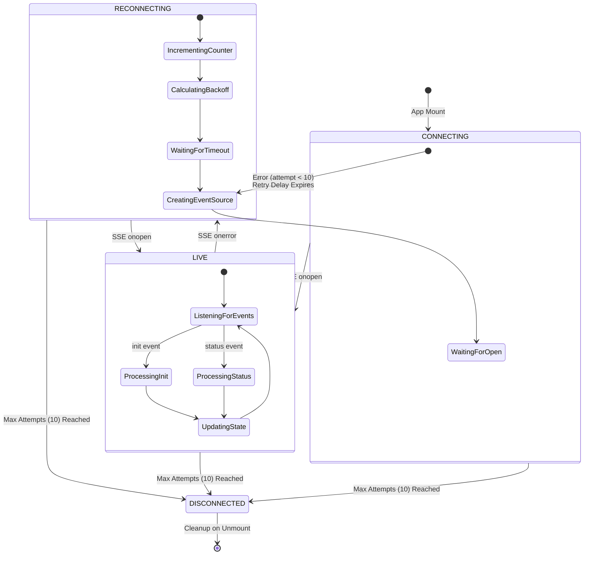
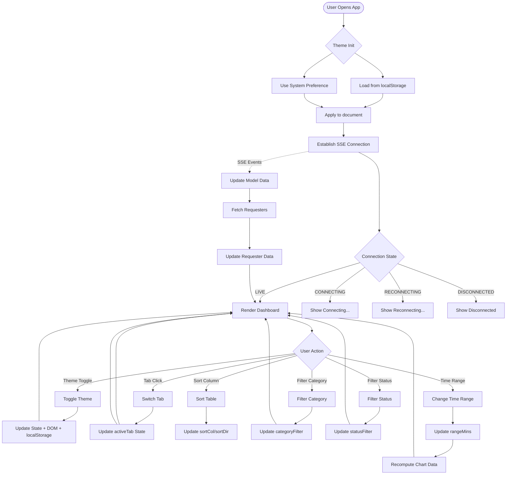
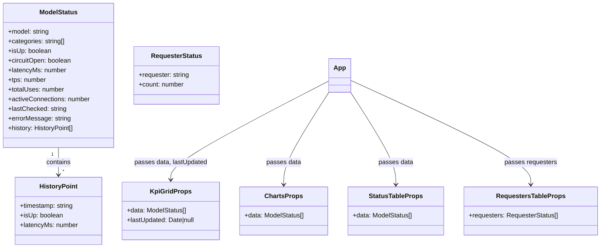
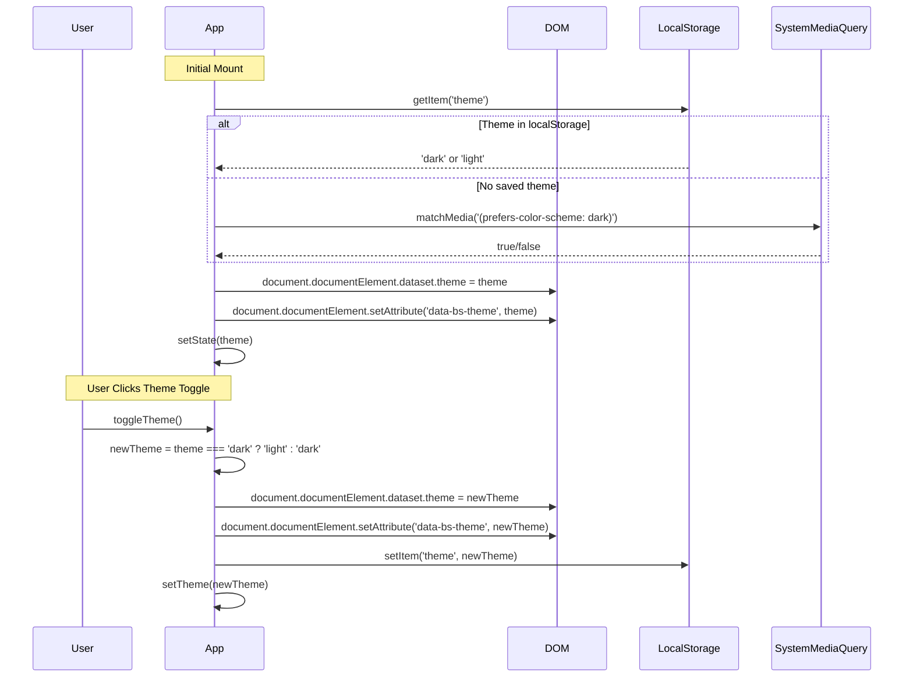
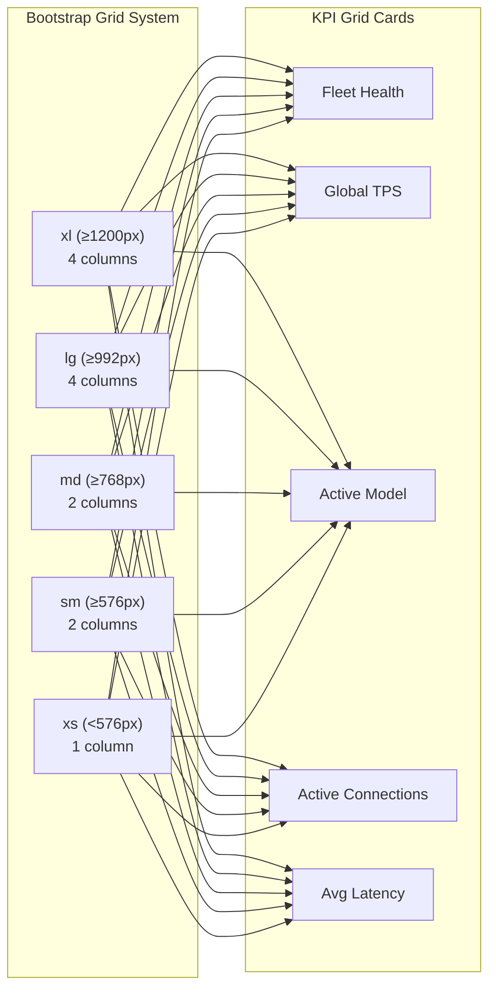
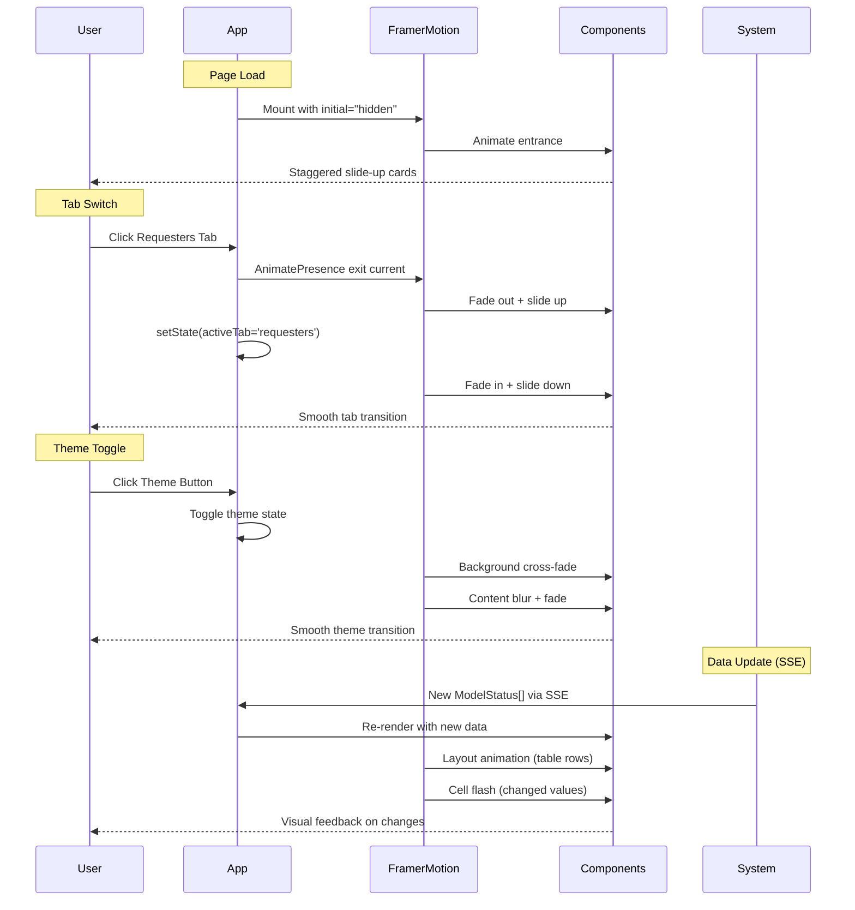

# Neural Gateway UI Flow Diagram

This document contains Mermaid diagrams illustrating the UI architecture, data flow, component relationships, and user interaction flows.

---

## 1. High-Level Architecture

```mermaid
graph TB
    subgraph "Client Browser"
        A[React App Entry<br/>main.tsx] --> B[App Component<br/>App.tsx]
        B --> C[Theme System<br/>Dark/Light Mode]
        B --> D[SSE Connection Manager<br/>EventSource]
        B --> E[State Management<br/>useState/useRef]
        
        D --> F[SSE Events<br/>init/status]
        D --> G[Connection Status<br/>CONNECTING/LIVE/RECONNECTING/DISCONNECTED]
        
        B --> H[Layout Components]
        H --> I[Navbar<br/>Brand, Status, Theme Toggle]
        H --> J[Main Content Area]
        
        J --> K[KpiGrid<br/>Dashboard Metrics]
        J --> L[Charts<br/>Latency + Usage]
        J --> M[Tab Navigation<br/>Models/Requesters]
        M --> N[StatusTable<br/>Model Details]
        M --> O[RequestersTable<br/>Requester Telemetry]
    end
    
    subgraph "Backend Services"
        P[Spring Boot API<br/>Port 8080]
        Q[SSE Endpoint<br/>/api/models/status/stream]
        R[REST Endpoint<br/>/api/requesters/status]
    end
    
    D -.->|Server-Sent Events| Q
    F -.->|fetch()| R
    
    style A fill:#e1f5fe
    style B fill:#f3e5f5
    style D fill:#fff3e0
    style P fill:#e8f5e9
    style Q fill:#e8f5e9
    style R fill:#e8f5e9
```

---

## 2. Component Hierarchy & Data Flow

```mermaid
graph TD
    subgraph "App.tsx (Root)"
        App[App Component]
        
        subgraph "State"
            S1[theme: 'dark'|'light']
            S2[connectionStatus: Enum]
            S3[data: ModelStatus[]]
            S4[requesters: RequesterStatus[]]
            S5[lastUpdated: Date|null]
            S6[activeTab: 'models'|'requesters']
        end
        
        subgraph "Refs"
            R1[eventSourceRef: EventSource]
            R2[reconnectAttemptsRef: number]
        end
    end
    
    subgraph "Components"
        KPI[KpiGrid.tsx]
        CHARTS[Charts.tsx]
        TABS[Tab Navigation]
        STABLE[StatusTable.tsx]
        RTABLE[RequestersTable.tsx]
    end
    
    App -->|data, lastUpdated| KPI
    App -->|data| CHARTS
    App -->|data| STABLE
    App -->|requesters| RTABLE
    App -->|activeTab| TABS
    TABS -->|controls| STABLE
    TABS -->|controls| RTABLE
    
    subgraph "External APIs"
        SSE[SSE Stream<br/>/api/models/status/stream]
        REST[REST API<br/>/api/requesters/status]
    end
    
    App -->|EventSource| SSE
    App -->|fetch()| REST
    
    SSE -->|init event| S3
    SSE -->|status event| S3
    REST -->|response| S4
    
    style App fill:#f3e5f5
    style KPI fill:#e1f5fe
    style CHARTS fill:#e1f5fe
    style STABLE fill:#e1f5fe
    style RTABLE fill:#e1f5fe
    style SSE fill:#fff3e0
    style REST fill:#fff3e0
```

---

## 3. SSE Connection Lifecycle



---

## 4. User Interaction Flows



---

## 5. Data Models & Type Definitions



---

## 6. Theme System Flow



---

## 7. Chart Data Processing Pipeline

```mermaid
flowchart LR
    subgraph "Charts.tsx"
        Input[ModelStatus[] data]
        Input --> Filter[Filter by rangeMins]
        Filter --> Bucket[Bucket into 1-min intervals]
        Bucket --> Align[Align timestamps across models]
        Align --> Dataset[Create Chart.js datasets]
        
        subgraph "Latency Chart (Line)"
            Dataset --> LConfig[Configure: tension, colors, fill]
            LConfig --> LChart[Line Chart Component]
        end
        
        subgraph "Usage Chart (Doughnut)"
            Dataset --> UConfig[Configure: colors, center text]
            UConfig --> UChart[Doughnut Chart Component]
        end
    end
    
    subgraph "Chart.js Config"
        LChart --> LAnim[Animation: duration 800ms, stagger]
        UChart --> UAnim[Animation: count-up center text]
    end
    
    LChart --> Render[Render to Canvas]
    UChart --> Render
    
    style Input fill:#e1f5fe
    style LChart fill:#fff3e0
    style UChart fill:#fff3e0
```

---

## 8. Responsive Layout Breakpoints



---

## 9. Error Handling & Edge Cases

```mermaid
flowchart TD
    Error[Error Occurs] --> Type{Error Type}
    
    Type -->|SSE Parse Error| ParseErr[console.error + continue]
    Type -->|SSE Connection Error| ConnErr[Increment Reconnect Counter]
    Type -->|Fetch Requesters Failed| FetchErr[Silent Fail - Keep Old Data]
    Type -->|Chart Data Empty| EmptyChart[Show Empty State]
    Type -->|Table Data Empty| EmptyTable[Show 'No data' Row]
    Type -->|Theme Toggle Error| ThemeErr[Revert to Previous]
    
    ConnErr --> CheckMax{Attempts ≥ 10?}
    CheckMax -->|Yes| Disconnected[Set DISCONNECTED]
    CheckMax -->|No| ScheduleRetry[setTimeout with Exponential Backoff]
    ScheduleRetry --> Reconnect[Call connectSSE()]
    
    Disconnected --> UserAction[Wait for User Refresh]
    
    style Error fill:#ffebee
    style Disconnected fill:#ffebee
    style ParseErr fill:#fff3e0
    style ConnErr fill:#fff3e0
```

---

## 10. Animation Flow (Proposed)



---

## How to View These Diagrams

1. **VS Code**: Install "Markdown Preview Mermaid Support" extension
2. **GitHub/GitLab**: Diagrams render automatically in markdown files
3. **Obsidian/Notion**: Native Mermaid support
4. **Online**: Copy into [Mermaid Live Editor](https://mermaid.live/)

---

## Legend

| Color | Meaning |
|-------|---------|
| 🔵 Light Blue | UI Components |
| 🟣 Purple | Root/State Management |
| 🟠 Orange | External APIs/Connections |
| 🟢 Green | Backend Services |
| 🔴 Red | Error States |
| 🟡 Yellow | Warning/Intermediate States |